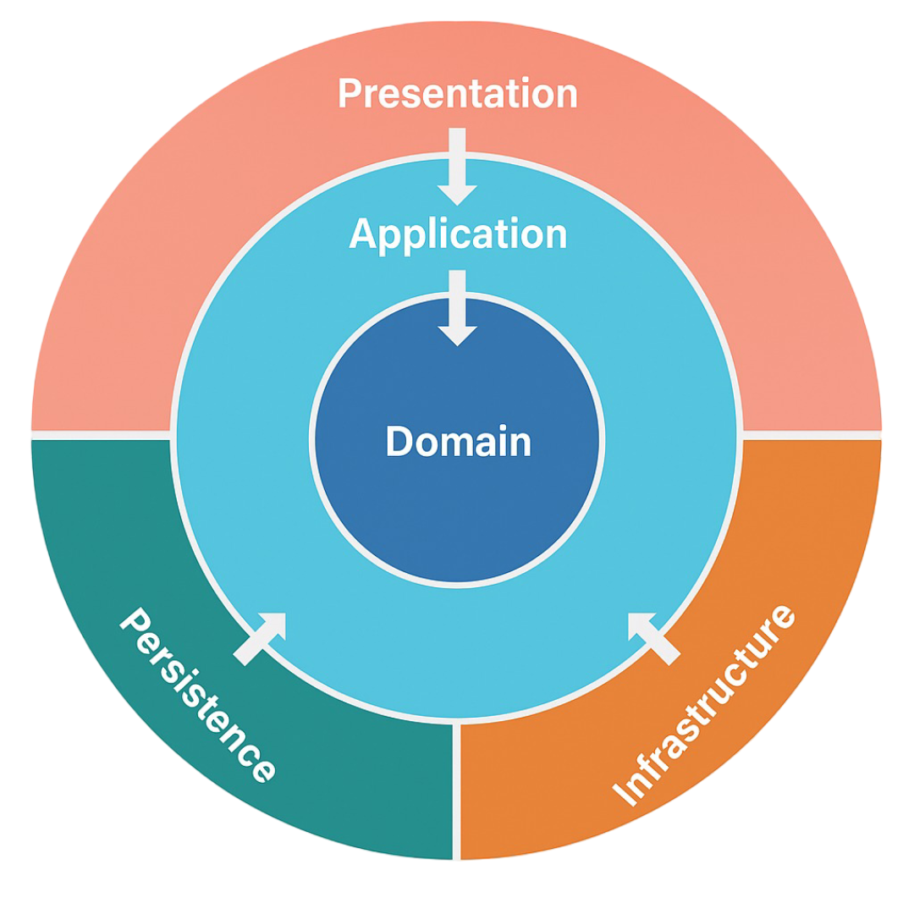

# 🚦 TrafficProcessor

**TrafficProcessor** is a toy **Spring Boot** project demonstrating a **multimodule, layered (hexagonal) architecture** for modern Java backend development.



It showcases clean modular design, domain-driven structure, and strong build-time governance using Maven Enforcer Plugin and google-java-format for consistent code style.

---

## 📝 Prerequisites

* Java 25 (`sdk install java 25-librca`)
* Java 25 native kit for native image (`sdk install java 25.r25-nik`)
* Maven
* Docker

---

## ✨ Key Features

* 🧩 **Multimodule design** with clear separation of concerns
* 🧱 **Hexagonal architecture** for flexibility and testability
* 🛠️ **Maven Enforcer Plugin** for dependency and build consistency
* 🧹 **Code formatting** with [google-java-format](https://github.com/google/google-java-format)
* 🗄️ **Flyway** for database migrations
* 💾 **Custom DynamoDB session configuration**
* 🔍 **Static code analysis**, **dependency vulnerability checks**, and **automated dependency updates**
* 📊 **Observability**, **benchmarking**, and **code coverage** integration
* 🌍 **Internationalization (i18n)**
* ⚡ **REST Endpoint** with **HATEOAS** support
* 🔗 **gRPC Endpoint** for fast data exchange
* 🐳 **OCI image builds** with **AOT** and **native image** support for optimized deployment

---

## ▶️ Running the application

* Run project with maven: `./mvnw clean install -Dmaven.test.skip && ./mvnw spring-boot:run -Prun-app -pl app`
* Create executable JAR: `./mvnw clean install -Dmaven.test.skip`
* Run executable JAR: `java -Dspring.datasource.username=demo -Dspring.datasource.password=secret -Dspring.datasource.url=jdbc:postgresql://localhost:5432/demodb -jar demo-app-0.0.1-SNAPSHOT.jar`

---

### 🔐 Test Login Credentials

For testing secured endpoints or accessing integrated services (e.g., via Keycloak-protected APIs):

```
Username: demo  
Password: demo
```

---

## 🚀 Available Services

After starting the **TrafficProcessor** application, the following services are available locally:

| Service                              | Description                                                       | URL                                            |
| ------------------------------------ | ----------------------------------------------------------------- | ---------------------------------------------- |
| **REST endpoint with Swagger UI**    | REST API documentation and testing interface                      | [http://localhost:8080](http://localhost:8080) |
| **gRPC Endpoint**                    | Exposes gRPC services for inter-module and external communication | [http://localhost:8081](http://localhost:8081) |
| **Grafana**                          | Observability dashboard for metrics visualization                 | [http://localhost:3000](http://localhost:3000) |
| **Keycloak**                         | Authentication and authorization server                           | [http://localhost:7080](http://localhost:7080) |
| **Kafka UI**                         | Interface for inspecting and managing Kafka topics and events     | [http://localhost:8083](http://localhost:8083) |

---

## 🏗️ Project Structure

The project follows a **multimodule layout** designed for scalability, separation of concerns, and reusability:

```
trafficprocessor/
├── core/                # Core layer
    ├── model/           # Domain model
    ├── core/            # Core business logic
├── adapter/             # Persistence, Presentation and DevOps layers
    ├── kafka/           # Kafka connector
    ├── persistence/     # Persistence modules
        ├── dynamo/      # DynamoDB persistence layer
        ├── jpa/         # JPA/PostgreSQL persistence layer
├── app/                 # Main entry point (Spring Boot application)
├── report/              # Aggregator of code coverage reports
```

* 🧭 **Core** Domain model and logic — independent of frameworks or external systems.
* 🔌 **Adapter** Handles persistence, messaging and exposes external endpoints (REST/gRPC)
* 🚀 **App** bootstraps the runtime environment and ties all modules together.

---

## ⚙️ Additional Functionalities

This section provides useful developer commands for advanced workflows such as dependency management, benchmarking, code coverage, and gRPC testing.

---

#### 🔄 Display Dependency Updates

Check for newer dependency versions in your build:

```bash
./mvnw versions:display-property-updates
```

---

#### 🏎️ Run Benchmarks with Maven

Execute performance benchmarks using the dedicated `benchmark` profile:

```bash
./mvnw clean install -Pbenchmark
```

Benchmark reports:
* `./app/target/TrafficEventRepositoryBenchmarkTest-{CURRENT_DATE}.json`
* `./app/target/TrafficProcessorServiceBenchmarkTest-{CURRENT_DATE}.json`

---

#### 🧪 Run Code Coverage with Maven

Generate a code coverage report using the `code-coverage` profile:

```bash
./mvnw clean install -Pcode-coverage
```

Coverage reports:
* `./report/target/site/jacoco-aggregate/`

---

#### 📡 Test gRPC Endpoints

List available gRPC services:

```bash
grpcurl --plaintext localhost:8081 list
```

Obtain an access token from **Keycloak**:

```bash
TOKEN=`curl -d 'client_id=democlient' -d 'username=demo' -d 'password=demo' -d 'grant_type=password' \
  'http://localhost:7080/realms/demorealm/protocol/openid-connect/token' | jq -r .access_token`
```

Process a traffic event via gRPC:

```bash
grpcurl -H "authorization: bearer $TOKEN" \
  -d '{"tollStationId": 0,"vehicleId": "string1","vehicleBrand": "VOLKSWAGEN","timestamp": 0}' \
  -plaintext localhost:8081 trafficprocessor.GrpcTrafficProcessorService.processTrafficEvent
```

Retrieve a traffic event via gRPC:

```bash
grpcurl -H "authorization: bearer $TOKEN" \
  -d '"0_string1"' \
  -plaintext localhost:8081 trafficprocessor.GrpcTrafficProcessorService.retrieveTrafficEvent
```

---

#### 🧱 Run DevLocal Stack

Build the OCI image and start the full **development stack** locally:

```bash
./maven-build-oci-image.sh
docker compose --profile devlocal up -d
```

---

#### ⚙️ Run Native DevLocal Stack

Build a **native image** and start the **native devlocal stack**:

```bash
./maven-build-native-oci-image.sh
docker compose -f compose-native.yaml --profile devlocal up -d
```

---

#### 🐇 Run the Native Application Manually

Build and run the native app directly:

```bash
export JAVA_HOME=$(sdk home java 25.r25-nik)
./mvnw clean install -Dmaven.test.skip -Pbuild-native-app
./traffic-processor-app \
  -Dspring.datasource.username=demo \
  -Dspring.datasource.password=secret \
  -Dspring.datasource.url=jdbc:postgresql://localhost:5432/demodb
```


